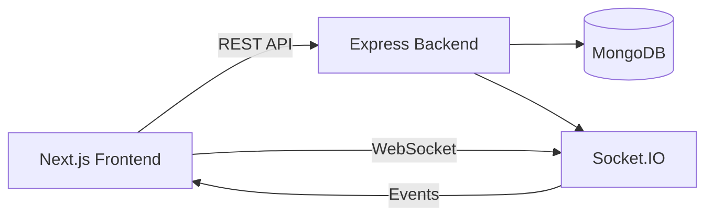
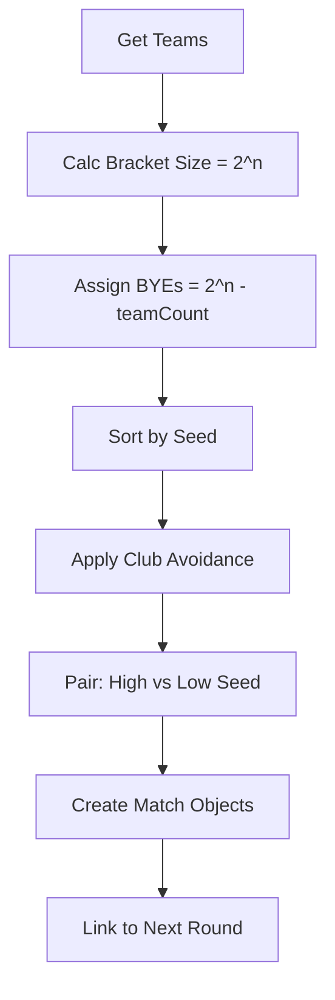
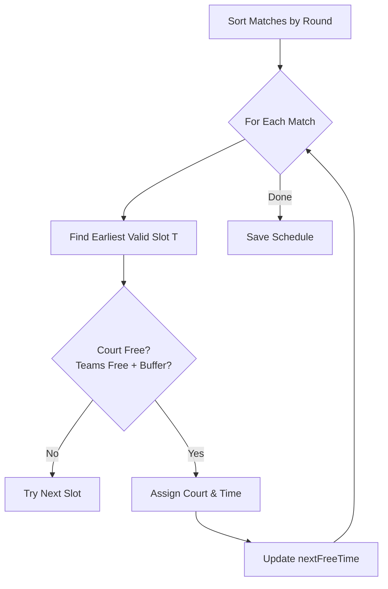
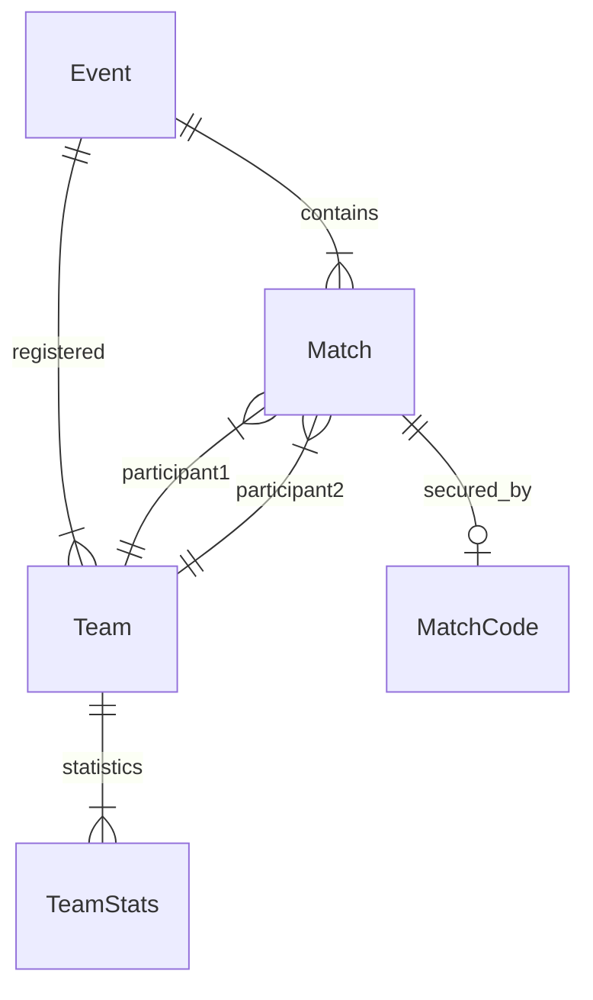
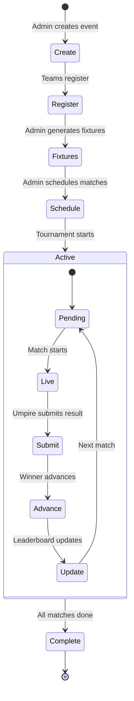
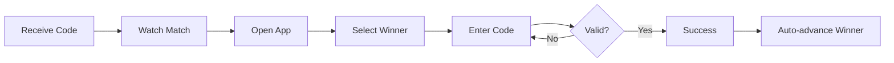
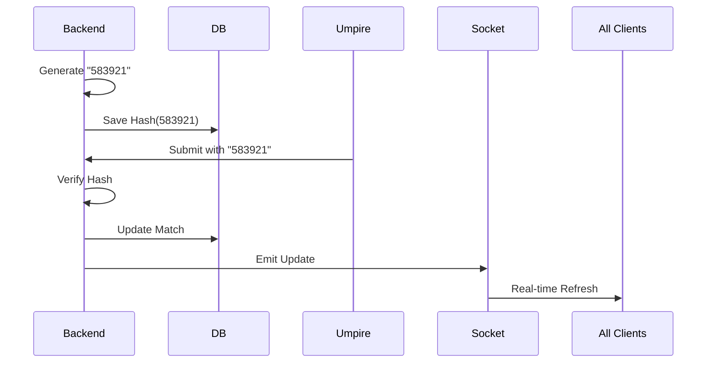

# CourtFlow - Tournament Management System
**Technical Documentation**

---

## System Overview

**CourtFlow** automates tournament management with smart fixture generation, multi-court scheduling, and real-time result tracking.

**Tech Stack:** Next.js + Node.js + Express + MongoDB + Socket.IO

**Key Features:**
- Knockout & Round Robin fixtures with BYE handling
- Same-club avoidance & seeding
- Multi-court scheduling (Earliest-Fit algorithm)
- Match-code authentication for results
- Real-time leaderboard updates

---

## Architecture



**Request Flow:** User Action → API Call → Auth Middleware → Controller → Service → Database → Response → UI Update

---

## Core Modules

| Module | Purpose | Key Algorithm |
|--------|---------|---------------|
| **Fixture Engine** | Generate brackets | Knockout: 2^n sizing, BYE allocation<br>Round Robin: Circle method |
| **Scheduling** | Assign time/court | Earliest-Fit with rest buffer |
| **Match Code** | Secure scoring | SHA-256 hashed 6-digit code |
| **Leaderboard** | Live standings | Real-time aggregation via Socket.IO |

---

## Knockout Fixture Algorithm



**BYE Logic:** High seeds get BYEs. BYE teams auto-advance when fixtures are saved.

---

## Scheduling Engine



**Constraints:**
- `T >= Court.nextFreeTime`
- `T >= Team.nextFreeTime + bufferMinutes`
- No overlapping matches

---

## Database Models

| Model | Key Fields |
|-------|------------|
| **Event** | name, type (knockout/round_robin), courts[], matchDuration, bufferMinutes |
| **Team** | teamName, clubName, members[], events[] |
| **Match** | eventId, participants[], round, matchNumber, nextMatchId, status, winnerId, startTime, endTime, courtId |
| **TeamStats** | eventId, teamId, played, won, lost, draw, points, goalDifference |

**ERD:**


---

## API Endpoints

| Endpoint | Method | Purpose |
|----------|--------|---------|
| `/api/events` | GET | List events |
| `/api/events` | POST | Create event (Admin) |
| `/api/events/:id/generate-fixtures` | POST | Generate bracket (Admin) |
| `/api/events/:id/schedule` | POST | Auto-schedule (Admin) |
| `/api/teams/register` | POST | Register team |
| `/api/matches/:id/generate-code` | POST | Generate match code (Admin) |
| `/api/matches/:id/submit-score` | POST | Submit result (requires code) |
| `/api/events/:id/leaderboard` | GET | Get standings |

**Example Request/Response:**

```http
POST /api/matches/64match1.../submit-score
Content-Type: application/json

{
  "winnerId": "64team1...",
  "matchCode": "583921"
}
```

```json
{
  "match": {
    "status": "completed",
    "winnerId": "64team1..."
  },
  "message": "Result submitted successfully"
}
```

---

## System Workflows

### Complete Tournament Flow



### Umpire Workflow



### Match Code Security



---

## Key Features Explained

**Same-Club Avoidance:**
- During seeding, if adjacent seeds belong to same club, swap them
- Prevents early same-club matchups in knockout

**Auto-Scheduling:**
- When both participants of a match are determined (winner advances), system automatically:
  - Assigns next available court
  - Calculates time = `earliestFinish + buffer`
  - Generates match code
  - Emits socket update

**Real-time Updates:**
- Result submission triggers Socket.IO events
- Leaderboard and bracket views auto-refresh
- No page reload needed

---

## Conclusion

CourtFlow eliminates manual tournament management through intelligent automation, providing organizers with a streamlined workflow and participants with real-time visibility into tournament progress.
